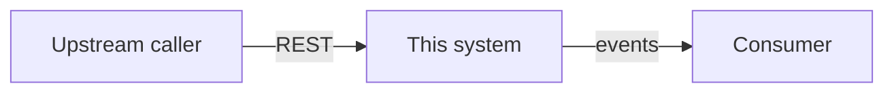

# High-level design: {system or capability name}

- **Status:** Draft | Reviewed | Approved
- **Date:** {YYYY-MM-DD}
- **Author:** {name}
- **Related ADRs:** {ADR-0001, ADR-0004}

## 1. Problem and scope

What business capability this delivers. Two paragraphs at most.

**In scope:** bullet list.
**Out of scope:** bullet list — this section prevents more arguments than any other.

## 2. Constraints and assumptions

Fixed constraints (on-premise, OpenShift, existing systems that cannot change) and
the assumptions this design rests on. Mark each assumption with how it will be
validated and what happens if it is wrong.

## 3. Context view

Who and what interacts with this system: users, upstream producers, downstream
consumers, external systems. A diagram plus a table of each interaction, its
direction, its protocol, and its expected volume.

## 4. Container view

The deployable units and the stores. For each: its single responsibility, its
technology from the platform set, and why it is a separate unit rather than part of
its neighbour.

| Unit | Responsibility | Technology | Why separate |
| --- | --- | --- | --- |

**Datastores.** For each: what it holds, why this store and not another, who owns
writes, who reads.

**Messaging.** For each topic or queue: producer, consumers, delivery semantics,
ordering requirement, retention.

## 5. Key flows

The two or three flows that matter, as sequences. Include the failure path for each,
not just the happy path.

## 6. Non-functional requirements

| Concern | Target | Basis |
| --- | --- | --- |
| Throughput | | measured / estimated / guessed |
| Latency (p95, p99) | | |
| Availability | | |
| Data durability | | |
| Retention | | |
| Recovery time objective | | |
| Recovery point objective | | |

Anything marked "guessed" is a risk. Say how it will be replaced with a measurement.

## 7. Cross-cutting concerns

Short sections, each pointing at the detailed artifact rather than repeating it.

- **Security:** identity, authorization model, data classification. → threat model.
- **Observability:** what a trace covers, what is logged. → observability plan.
- **Metrics and SLOs:** the SLIs and their targets. → metrics strategy.
- **Reliability:** the top failure modes and the response to each. → reliability review.
- **Scale:** the sizing basis and what breaks first. → scale plan.

## 8. Alternatives rejected

The designs that were considered and dropped, with the reason. One paragraph each.

## 9. Open questions

Numbered, each with an owner and a date by which it must be closed. An open question
without an owner is a future incident.

## 10. Delivery shape

Rough phasing: what has to exist first, what can follow, what the first deployable
increment is.
