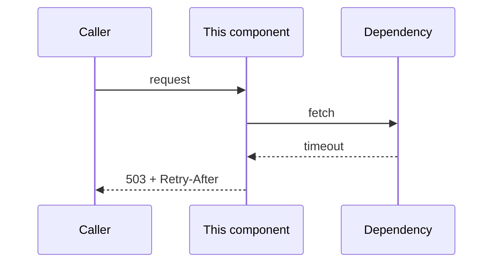

# Detailed design: {component name}

- **Status:** Draft | Reviewed | Approved
- **Date:** {YYYY-MM-DD}
- **Parent HLD:** {link}
- **Related ADRs:** {list}

## 1. Responsibility

One sentence describing what this component is responsible for. If it needs "and",
consider whether it should be two components — check
`/architect:separation-of-concerns` before deciding it should not.

## 2. Internal structure

The layers or modules inside this component and the dependency direction between
them. Name the rule that keeps the direction acyclic.

| Module | Responsibility | Depends on | May not depend on |
| --- | --- | --- | --- |

## 3. Data model

For each collection, index, or table:

- **Purpose and access patterns first**, schema second. Schema follows queries.
- Key / shard key / partition key, and why.
- Indexes, each justified by a named query.
- Expected document or row size and cardinality growth.
- Retention and deletion: what removes old data, and when.

For Oracle, MongoDB, and Elasticsearch specifics, run `/architect:detail-design`,
which carries the per-datastore standards.

## 4. Interfaces

**Inbound.** Every entry point: endpoint, event subscription, scheduled trigger.
Link the contract; do not restate it here.

**Outbound.** Every call this component makes, with timeout, retry policy, and what
happens when it fails permanently.

| Dependency | Call | Timeout | Retry | On permanent failure |
| --- | --- | --- | --- | --- |

## 5. Sequences

The main flows as diagrams, each including the failure branch.

## 6. State and concurrency

What state exists, where it lives, and what happens with N replicas running.
Specifically: is any operation not safe to run twice? If so, what makes it
idempotent — an idempotency key, a conditional write, a unique index?

## 7. Error handling

| Failure | Detected by | Response | Visible as |
| --- | --- | --- | --- |

Distinguish errors the caller can act on from errors they cannot. See
the org error standard (`/architect:api-design`).

## 8. Configuration

Every tunable, its default, its valid range, and what it costs to get wrong.
Configuration that must differ per environment is called out explicitly.

## 9. Instrumentation

The spans this component emits, the metrics it exports, and the log events that
matter. Point at the observability plan rather than duplicating it.

## 10. Test strategy

What is covered by unit tests, what needs an integration test against a real
MongoDB / Kafka / Elasticsearch, and what can only be verified in a load test.
Name the specific failure modes the tests are meant to catch.

## 11. Assumptions

The things this design takes as true. Each with how it is validated.
